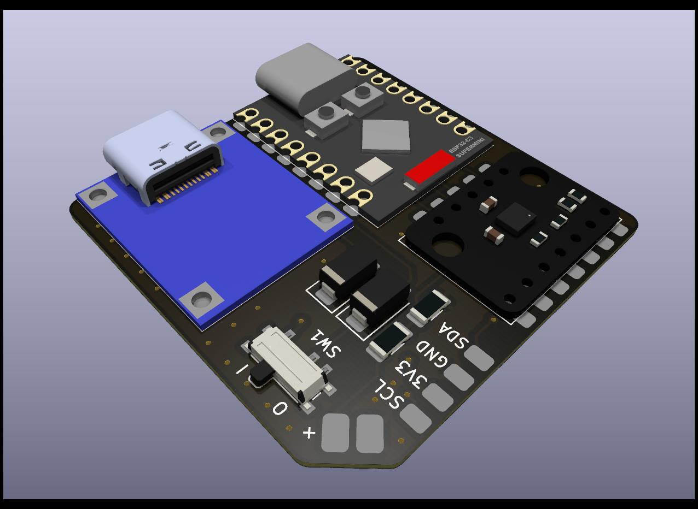

# Tiny Slime

Tiny Slime aims to make the smallest possible SlimeVR trackers out of cheap and
readily available modules while still preserving battery life.

The design uses a PCB to mount the parts to, which is placed right on top of
the battery for minimal height. The final case dimensions, without the strap
loops end up being around 43x43x15.2 mm or 43x43x12.2 mm.

## BOM

| Part                                  | Count | Source                                                                |
| ------------------------------------- | ----: | --------------------------------------------------------------------- |
| Tiny Slime PCB                        |     1 | JLCPCB                                                                |
| Tiny Slime Case                       |     1 | Print Yourself                                                        |
| Supermini ESP32C3                     |     1 | [AliExpress](https://www.aliexpress.com/item/1005005877531694.html)   |
| BMI160                                |     1 | [AliExpress](https://www.aliexpress.com/item/4000052683444.html)      |
| Unprotected TP4056 1       |     1 | [AliExpress](https://www.aliexpress.com/item/1005005468881238.html)\* |
| PCM12 compatible switch               |     1 | [AliExpress](https://www.aliexpress.com/item/4000685483225.html)      |
| SS34 diode                            |     2 | [AliExpress](https://www.aliexpress.com/item/1005002813143363.html)   |
| 1206 100k Ω resistor                  |     2 | [AliExpress](https://www.aliexpress.com/item/1005006358156511.html)\* |
| 804040 or 504040 battery 2 |     1 | [AliExpress](https://www.aliexpress.com/item/1005002559604104.html)   |

> [!TIP]
> The case is compatible with any BMI breakout shaped module. Check out [Meia's
> IMU store](https://store.kouno.xyz) for some recommended alternatives usable on
> this board!

\*: Link is multi-choice, pay careful attention to which you select

2: For size reasons, the PCB uses specifically unprotected TP4056 modules.

3: Battery choice is a trade-off. The 804040 should give you 800 mAh more
capacity at the cost of 3 extra millimeters in height.

Components, including straps cost about $11 per tracker shipped.

> [!TIP]
> These links only act as examples. They will almost certainly not be the best
> prices for you, as that depends on where you live and what options you have
> available to you. If you want to min-max the prices, do search around for
> better deals. Just make sure you are getting the right components!

> [!TIP]
> Some components are more prone to arriving dead, like BMI160. Because of this,
> and just to be safe, make sure to get a few extras from everything.

> [!CAUTION]
> Since the TP4056 module the PCB is using is unprotected, make sure to only
> ever pair it with a battery that comes with a protection board. Usually
> protected batteries have yellow tape around their top side which houses a
> small protection PCB. Using unprotected batteries could lead to them dying
> or in extreme cases catching fire or exploding.

## PCB Ordering

The gerber zip file for the PCB can be downloaded from the "production" folder
of the repository. This needs to be ordered from a PCB manufacturer, such as
JLCPCB.

### Ordering from JLCPCB

1. Visit [JLCPCB's site](https://jlcpcb.com)
2. Hit the "Add gerber file" button and select the zip file you've downloaded
3. Select the quantity of PCBs you want
4. Set the PCB thickness to 0.8 and select a colour you like

> [!IMPORTANT]
> Some colours might incur further costs, because they are rarer. Black and
> green are almost always free to choose.

5. For the "Remove Order Number" option, choose "Specify a location"
6. Make sure PCB Assembly is ticked **off**
7. Save the order to your cart and complete the ordering process

If you've done everything correctly, 5 PCBs should cost about $5 while 10 should
cost about $7 with shipping included. You can of course choose a quicker
shipping method, but the AliExpress components take more time to arrive.

> [!TIP]
> It's recommended that you purchase more boards than you'd strictly need, since
> they are fairly cheap and mistakes can easily happen.
